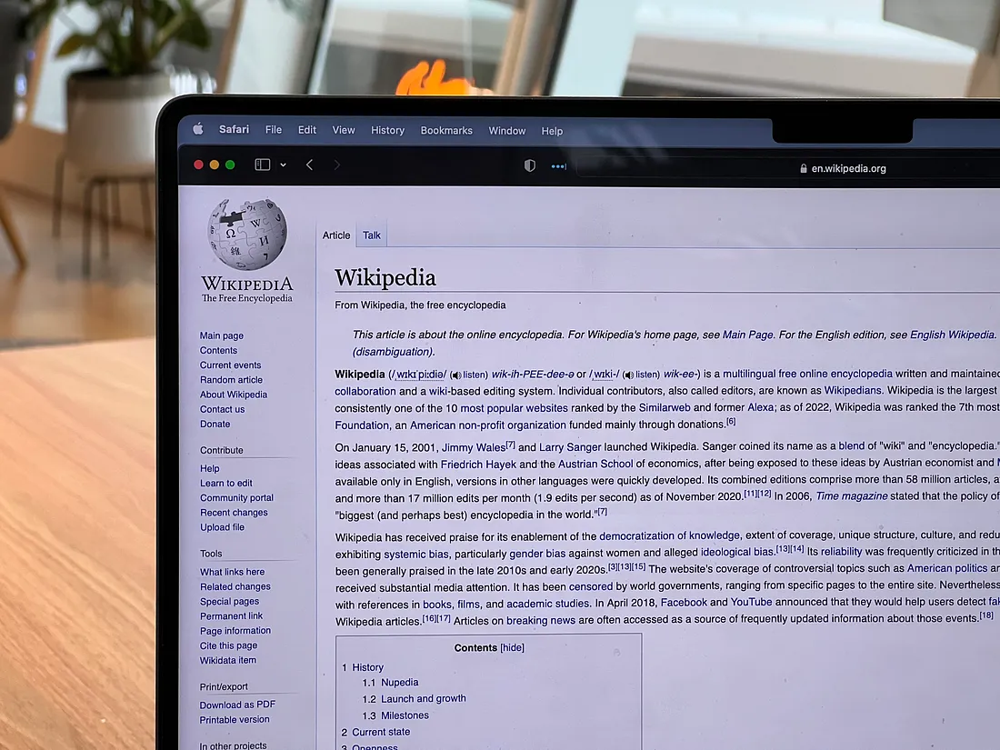

# Wikimedia-Text-Preprocessing-and-Visualization-Project

 

## Business Problem

Perform text preprocessing and visualization on the data set containing Wikipedia texts.

## Features of Dataset

- **Total Features :** 1
- **Total Row :** 10.859
- **CSV File Size :** 50.6 MB

## Project Steps

1. Text Preprocessing Processes (Normalazing Case Folding, Punctuations, Numbers, Remove Stop Words, Rare Words, Tokenization, Lemmatization etc).

2. Text Visualization Processes (Calculation of Term Frequencies, Drawing Barplot Chart, Creating Word Cloud).

3. Writing All Stages as a Single Function.
